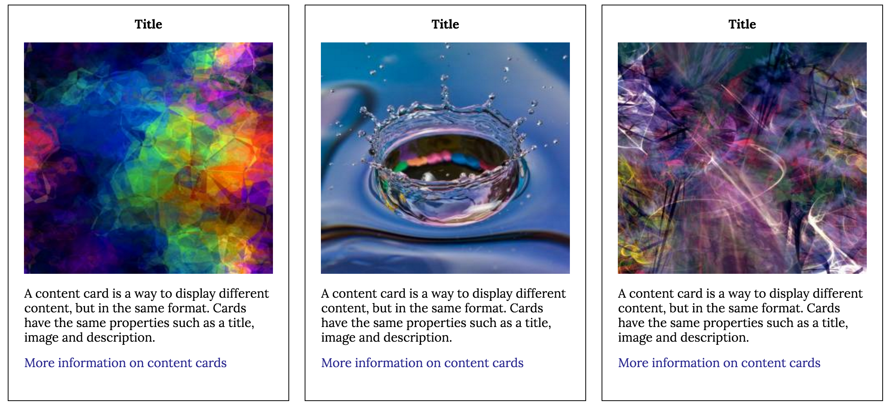

# style-guides

[Style Guides](https://swanie21.github.io/style-guides/)

##Introduction
Every week for four weeks I'll be creating style guides of specific page elements that can be highly reusable. They will incorporate responsive design, HTML, CSS, SASS, and JS.

Week One: Build a primary navigation bar
* Responsive design
* On desktop navigation links are inline elements
* On small devices links appear as a dropdown menu
* Includes a sign-up button
* Includes an icon placeholder for the logo

Week Two: Build a content card
* Responsive design
* Includes a title
* Includes a description
* Includes an image
* Includes a nicely styled link

Week Three: Build an accordion tab
* Responsive design
* Include titles on each tab
* Selected tab should be differentiated from the unselected tabs
* Selected tab should show the tab's title content, which includes a header and body element

Week Four: Build a footer
* Responsive design
* Includes an icon placeholder for the logo
* Includes placeholder links for site navigation, social media links, terms & conditions, and privacy policy
* Copyright blurb
