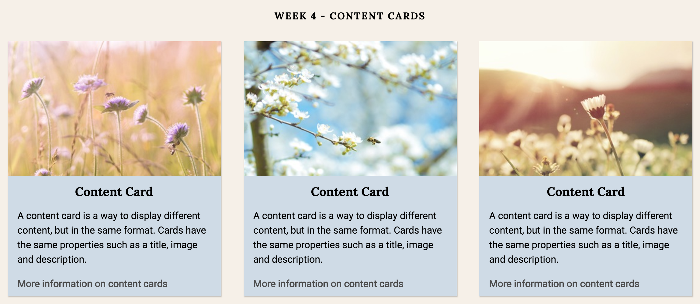

# style-guides

##Introduction
Every week for seven weeks I'll be creating style guides of specific page elements that can be highly reusable. They will incorporate responsive design, HTML, CSS, SASS, and JS.

Week One: Build a primary navigation bar
* Responsive design
* On desktop navigation links are inline elements
* On small devices links appear as a dropdown menu
* Includes a sign-up button
* Includes an icon placeholder for the logo

Week Two: Build a content card
* Responsive design
* Includes a title
* Includes a description
* Includes an image
* Includes a nicely styled link
